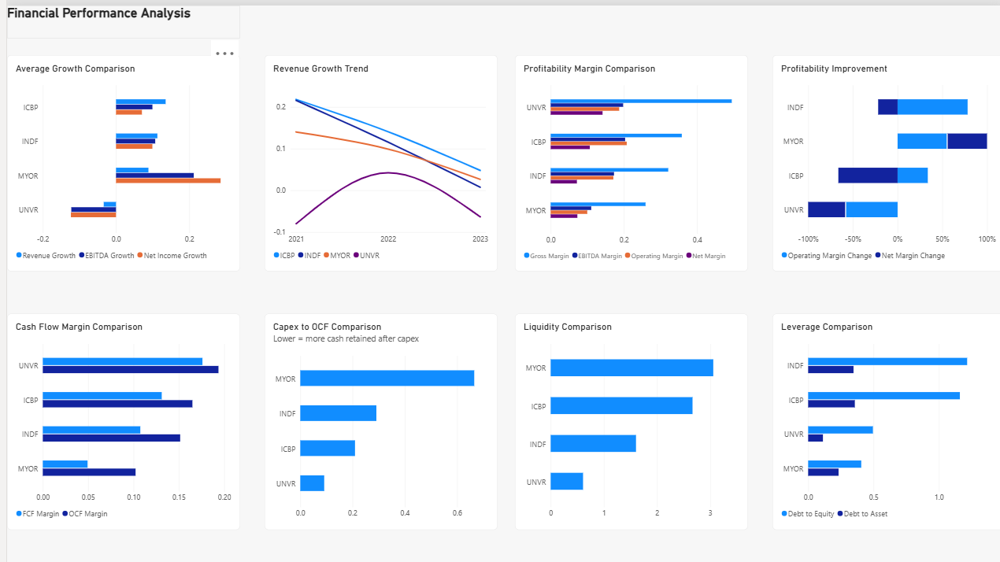
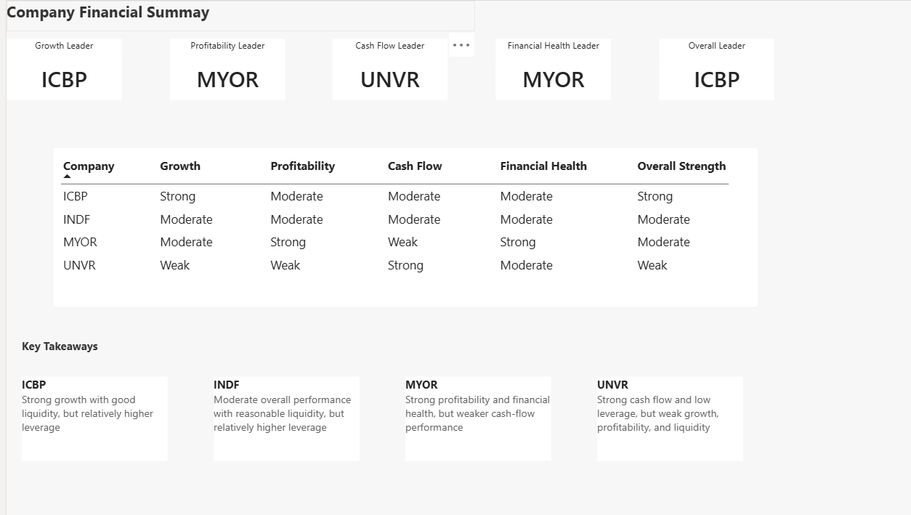

# Financial Performance Analysis — Indonesian Consumer Companies

## Project Overview

Financial performance analysis of four publicly listed Indonesian consumer companies over **2020–2023**:

| Ticker | Company |
|---|---|
| ICBP | PT Indofood CBP Sukses Makmur Tbk |
| INDF | PT Indofood Sukses Makmur Tbk |
| MYOR | PT Mayora Indah Tbk |
| UNVR | PT Unilever Indonesia Tbk |

The project evaluates **growth, profitability, cash flow, liquidity, and leverage** using historical financial statement data.

## Business Objective

The analysis aims to answer:

- Which companies showed stronger revenue and earnings growth?
- How did profitability compare across companies?
- Which companies generated stronger operating and free cash flow?
- How did liquidity and leverage differ?
- What are the main financial strengths and weaknesses identified from the analysis?

## Data Source

Financial data was obtained from publicly available financial statements of companies listed on the Indonesia Stock Exchange (IDX).

**Original source:** [IDX Financial Statements & Annual Reports](https://idx.id/en/listed-companies/financial-statements-and-annual-report)

**Period:** 2020–2023

The source data was consolidated and prepared for analysis.

## Analysis

Key metrics include:

- Revenue, EBITDA and Net Income Growth
- Gross, EBITDA, Operating and Net Margins
- Free Cash Flow (FCF) and Operating Cash Flow (OCF)
- FCF Margin and OCF Margin
- Capex-to-OCF
- Current Ratio
- Debt-to-Equity
- Debt-to-Asset

### Workflow

**Financial Statements → Data Preparation → SQL Checks → Excel Analysis → Power BI Dashboard → Business Insights**

- **SQL / PostgreSQL:** basic querying and data checks
- **Excel:** financial calculations and company-level analysis
- **Power BI:** interactive visualization and dashboard development

## Dashboard

### Financial Performance Analysis



### Company Financial Summary



## Key Findings

- **ICBP:** Strong growth with relatively good liquidity, although leverage was relatively higher.
- **INDF:** Moderate overall performance with reasonable liquidity and relatively higher leverage.
- **MYOR:** Strong profitability and financial health, but weaker cash-flow performance relative to the other companies.
- **UNVR:** Strong cash flow and relatively low leverage, but weaker growth, profitability and liquidity during the period.

### Company Summary

| Company | Growth | Profitability | Cash Flow | Financial Health | Overall |
|---|---|---|---|---|---|
| ICBP | Strong | Moderate | Moderate | Moderate | Strong |
| INDF | Moderate | Moderate | Moderate | Moderate | Moderate |
| MYOR | Moderate | Strong | Weak | Strong | Moderate |
| UNVR | Weak | Weak | Strong | Moderate | Weak |

## Tools

- **Microsoft Excel** — financial analysis
- **SQL / PostgreSQL** — querying and data checks
- **Power BI Desktop** — dashboard and visualization

## Project Files

```text
financial-performance-analysis/
├── README.md
├── images/
│   ├── financial_performance_dashboard.png
│   └── company_financial_summary.png
├── sql/
│   └── financial_analysis.sql
├── excel/
│   └── financial_analysis.xlsx
└── powerbi/
    └── financial_performance_analysis.pbix
```

## Note

This is an analytical portfolio project based on publicly available financial information. The **Strong / Moderate / Weak** classifications are analytical summaries based on the selected financial metrics and are intended to communicate the results of this analysis, not investment recommendations.

The analysis covers **2020–2023** and should not be interpreted as a representation of current company performance.
