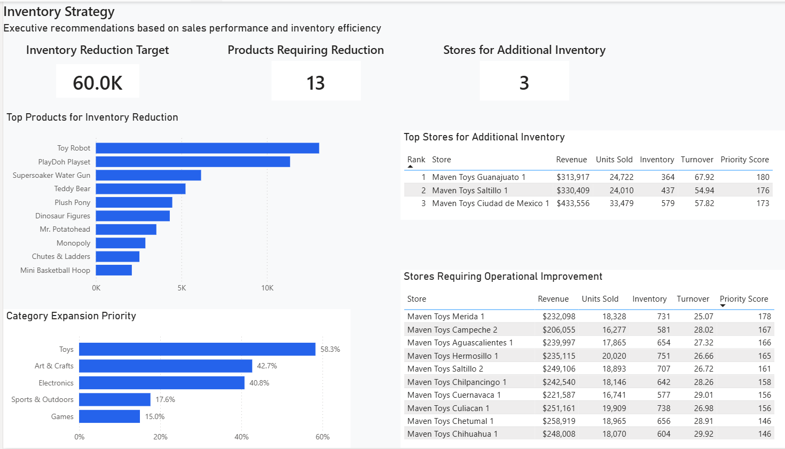

# Inventory Strategy Analysis

An end-to-end SQL and Power BI project using retail sales and inventory
data to support practical inventory decisions.

## Overview

This project analyzes product, store, and category performance to answer
four business needs:

- Where can inventory be reduced?
- Which stores are the strongest candidates for additional inventory?
- Which product categories should be considered for expansion?
- Which stores should be reviewed for operational improvement before
  receiving additional inventory?

The analysis combines sales performance with inventory efficiency rather
than relying on a single metric.

## Approach

The analysis was completed in PostgreSQL using SQL and then presented in
Power BI.

Key measures used include:

- Revenue
- Units sold
- Inventory value
- Inventory turnover
- Ranking and priority scores

For category expansion, revenue and units sold were given more weight
because they directly reflect sales performance, while inventory
turnover and inventory level were used to assess inventory efficiency.

For inventory reduction, a 20% inventory-value reduction target was
translated into product-level recommendations based on the priority
analysis.

## Key Findings

- A 20% inventory reduction represents approximately **$59.99K** of
  inventory value.
- **13 products** have a recommended inventory reduction.
- **3 stores** are recommended for additional inventory investment.
- **Toys** has the highest category expansion-priority score at
  **0.583 (58.3%)**, followed by Art & Crafts (**0.427 / 42.7%**) and
  Electronics (**0.408 / 40.8%**).
- The analysis also identifies stores where lower revenue and units sold,
  low inventory turnover, and relatively high inventory suggest that
  operational improvement should be considered before adding more stock.

## Dashboard

The Power BI dashboard brings the analysis together into one executive
view, covering:

- Inventory reduction priorities
- Store investment recommendations
- Category expansion priorities
- Stores requiring operational review

## Dataset

This project uses the publicly available **Mexico Toy Sales** dataset
from Maven Analytics. The dataset contains sales and inventory data for
a fictitious toy store chain in Mexico, including product, store, daily
sales transaction, and inventory information.

**Source:** Maven Analytics — Mexico Toy Sales  
**License:** Public Domain

Source: https://mavenanalytics.io/data-playground/mexico-toy-sales

The original dataset is included in the `Dataset Maven Toys` folder.
It contains six CSV files:

- `calendar.csv`
- `data_dictionary.csv`
- `inventory.csv`
- `products.csv`
- `sales.csv`
- `stores.csv`

## Tools

- **PostgreSQL / SQL** — data analysis, calculations, ranking, and
  recommendation logic
- **Power BI** — dashboard design and business storytelling

## Project Files

| File / Folder | Description |
|---|---|
| `inventory_strategy_analysis.sql` | SQL analysis and recommendation logic |
| `inventory_strategy_dashboard.pbix` | Power BI dashboard |
| `Inventory_Strategy_Documentation.docx` | Recruiter-facing project documentation |
| `Dataset Maven Toys/` | Original Maven Toys dataset containing the six CSV files |
| `dashboard_preview.png` | Preview of the Power BI dashboard |
| `README.md` | Project overview, approach, findings, and file guide |

## What This Project Demonstrates

This project demonstrates how I use SQL and Power BI to move from raw
business data to a set of practical recommendations, while keeping the
analysis connected to measurable business performance.
